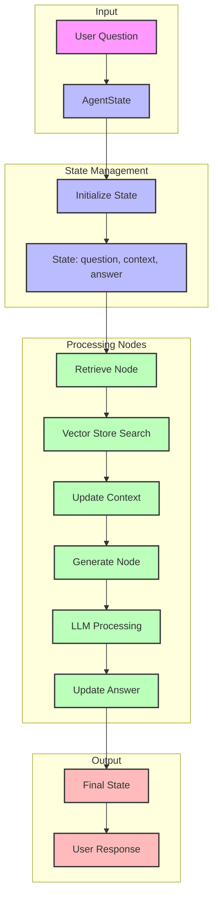
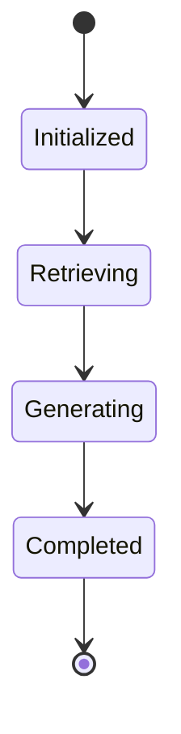
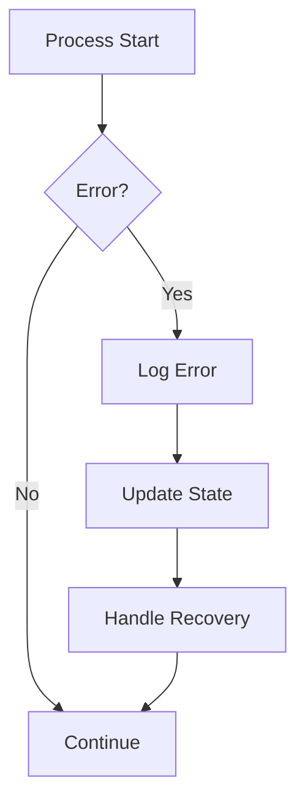

# LangGraph Workflow Diagram

## Workflow Description

1. **Input Processing**
   - User question is received
   - Initial AgentState is created

2. **State Management**
   - State is initialized with empty context and answer
   - Question is stored in state
   - State transitions are tracked

3. **Processing Nodes**
   - Retrieve Node: Searches vector store
   - Context Update: Adds relevant documents
   - Generate Node: Processes with LLM
   - Answer Update: Stores final response

4. **Output Generation**
   - Final state is processed
   - Response is formatted
   - Answer is returned to user

## State Transitions

## Error Handling

