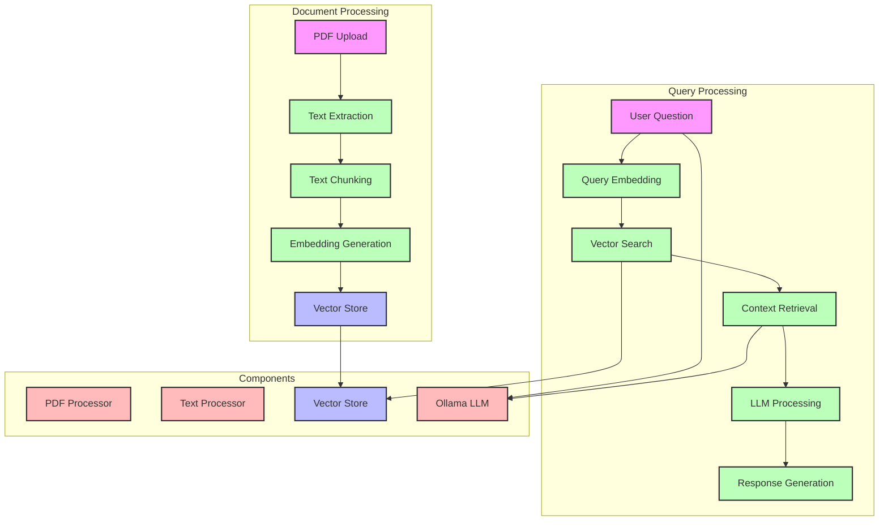

# RAG Flow Diagram

## Document Processing Flow

1. **PDF Upload and Processing**
   - PDF file is uploaded
   - Text is extracted from pages
   - Content is validated

2. **Text Processing**
   - Text is split into chunks
   - Chunks are normalized
   - Overlap is managed

3. **Embedding Generation**
   - Chunks are converted to embeddings
   - Embeddings are normalized
   - Batch processing is used

4. **Vector Store**
   - Embeddings are indexed
   - Metadata is stored
   - Persistence is managed

## Query Processing Flow

1. **Question Processing**
   - User question is received
   - Query embedding is generated
   - Search parameters are set

2. **Context Retrieval**
   - Vector search is performed
   - Relevant chunks are retrieved
   - Context is formatted

3. **Response Generation**
   - Context and question are combined
   - LLM generates response
   - Answer is formatted

## Component Interactions

